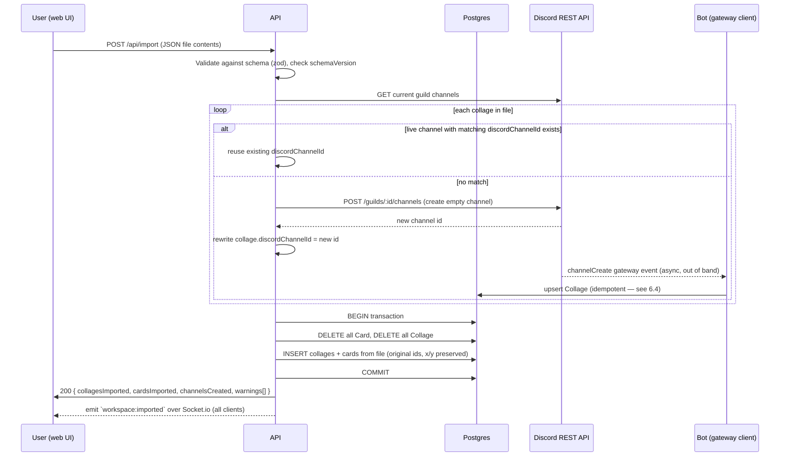

# Feature Design: Data Import & Export

> Status: draft — for review. Companion to [`DESIGN.md`](../DESIGN.md) and [`ARCHITECTURE.md`](ARCHITECTURE.md).

## 1. Overview & Goals

Give the user a way to get their entire workspace (every collage and every card) out of Punk Records as a single file, and back in again. Primary use cases:

- **Backup / disaster recovery** — a portable snapshot independent of the Supabase instance and the EC2 host.
- **Migration** — moving to a new Discord server or a fresh database without losing history.

This is explicitly a **personal-tool-scale** feature: modest data volumes, synchronous processing, no streaming/pagination/chunking.

## 2. Confirmed Requirements (from stakeholder)

These were specified directly and are treated as fixed constraints, not open questions:

| # | Requirement |
|---|---|
| 1 | Import/export operate on the **whole workspace** in one shot — one file represents every collage and card. Import **wipes and replaces the entire dataset**, not a merge. |
| 2 | **No image support.** `IMAGE`-type cards are excluded from both export and import entirely. |
| 3 | Download/processing speed is **not** a priority — synchronous, simple implementations are fine. |
| 4 | Import may create empty Discord channels for collages that have no live channel match. **Exact mirroring with Discord is explicitly not required** — a disconnect between Discord and the app's data (e.g. a channel with cards in the app but no matching message history in Discord) is acceptable. |
| 5 | Card **canvas positions** (`x`, `y`, `width`, `height`) must be captured in export and restored on import — layout is part of "the user's data," not something to be recomputed. |
| 6 | Private canvases (`isPrivate: true`) are included in export/import like any other collage — the private gate is UI-only obscurity, not real access control, so there's nothing extra to gate here. |
| 7 | Entry point is the **web UI** — a self-service action the user triggers from the app, not an API-only/admin tool. |

## 3. Explicit Data-Loss Warning

Requirements #1 and #2 combine into a real trap and need to be visible to the user, not just buried in code:

**Any import permanently deletes all IMAGE cards currently in the workspace, with no way to recover them from the export file — because the export file never contained them in the first place.**

This is true even for a "restore my own recent backup" scenario: export today, add three image cards tomorrow, import yesterday's file — those three image cards are gone, unrecoverably, along with anything else added since the export. The import confirmation UI (§7.3) must say this explicitly, not just "this will overwrite your data."

## 4. Assumptions & Decisions

Things not covered by the confirmed requirements above, where I've picked a default. Flagging these so they're easy to challenge.

| Decision | Reasoning |
|---|---|
| **File format: single JSON file.** Not CSV/SQLite/zip. | Cards have nested, variably-shaped OG metadata; JSON is the natural fit and needs no extra libraries. |
| **IDs are preserved as-is** in the export (`Collage.id`, `Card.id`), and import writes them back verbatim rather than regenerating. | Keeps `Card.collageId` references trivially consistent between export and import — no ID-remapping pass needed. Cuid strings are safe to reuse across a fresh database. |
| **OG metadata (`ogTitle`, `ogImage`, etc.) is exported as captured and NOT re-scraped on import.** | The scrape result is itself the user's data (a tweet or Reddit post referenced by a card may later be edited or deleted) — re-scraping on import would silently change history and adds needless external API calls. |
| **Export/import live in the API package**, not the bot. Discord channel creation during import uses a raw Discord REST call (same pattern already used in `packages/api/src/routes/upload.ts`), not the bot's gateway client. | Avoids adding cross-process coordination between API and bot for this feature; the API already talks to the Discord REST API directly for image uploads. |
| **No new auth on the new endpoints**, consistent with the rest of the API. Flagged as a real concern in §8, not silently accepted. | Out of scope to solve unless you want it, but a destructive whole-workspace endpoint with zero auth is a meaningfully bigger risk than the read-mostly endpoints that exist today. |
| **Doc location**: this file, `docs/import-export-design.md`. | Keeps it alongside the onboarding architecture doc without bloating `DESIGN.md`. |

If any of these should go the other way, say so before I move to implementation.

---

## 5. Export

### 5.1 Trigger

A new "Export data" action in the web UI (see §7.1). `GET /api/export`, no request body. Returns the JSON file as a download (`Content-Disposition: attachment; filename="punk-records-export-<ISO timestamp>.json"`).

### 5.2 Schema

```json
{
  "schemaVersion": 1,
  "exportedAt": "2026-08-17T18:32:00.000Z",
  "collages": [
    {
      "id": "clx1y2z3...",
      "name": "music inspo",
      "discordChannelId": "1123456789012345678",
      "isPrivate": false,
      "createdAt": "2026-01-04T09:00:00.000Z",
      "cards": [
        {
          "id": "clabc123...",
          "type": "LINK",
          "content": "https://youtube.com/watch?v=abc123",
          "notes": null,
          "url": "https://youtube.com/watch?v=abc123",
          "ogTitle": "My Favourite Video",
          "ogDescription": "A short description...",
          "ogImage": "https://i.ytimg.com/vi/abc123/hqdefault.jpg",
          "ogSiteName": "YouTube",
          "ogFavicon": "https://youtube.com/favicon.ico",
          "x": 412.5,
          "y": -230.0,
          "width": 280,
          "height": 160,
          "source": "DISCORD",
          "discordMessageId": "1198877665544332211",
          "createdAt": "2026-01-04T09:03:12.000Z"
        }
      ]
    }
  ]
}
```

- `schemaVersion` lets a future format change reject or migrate old export files instead of silently misreading them.
- `Card` rows where `type === "IMAGE"` are omitted from the `cards` array entirely — not included with a placeholder, just absent.
- Field set mirrors the Prisma `Card`/`Collage` models 1:1 (see `packages/shared/prisma/schema.prisma`) minus the image-specific concern.

### 5.3 Server logic

```
GET /api/export
  → prisma.collage.findMany({ include: { cards: { where: { type: { not: 'IMAGE' } } } } })
  → serialize to the schema above
  → res.setHeader('Content-Disposition', ...); res.json(payload)
```

No pagination, no streaming — one query, one response, per the "speed isn't a priority" constraint.

---

## 6. Import

### 6.1 Trigger

"Import data" action in the web UI (§7.1): user picks a `.json` file, client reads it with `FileReader`, and `POST`s the parsed JSON body to `/api/import`. A confirmation step (§7.3) happens before the request fires.

### 6.2 High-level flow



### 6.3 Discord channel reconciliation

For each collage in the import file:

1. Look up whether a text channel with that `discordChannelId` currently exists in `DISCORD_GUILD_ID` (one `GET /guilds/:id/channels` call up front, matched in memory rather than N lookups).
2. **Match found** → keep the `discordChannelId` as-is. The channel's actual name isn't forced to match the imported collage name — renaming it is out of scope (the channel is the source of truth for its own name going forward, same as today).
3. **No match** (fresh Discord server, deleted channel, or a plain database restore where nothing in Discord ever matched) → create a new, empty text channel via `POST /guilds/{guild.id}/channels`:
   - Name: derived from `collage.name` by reversing `channelNameToCollageName` (`packages/bot/src/utils.ts`) — spaces to hyphens, prefixed with `canvas-` or `canvas-private-` per `isPrivate`, lowercased, and sanitized to Discord's channel-name charset (`[a-z0-9_-]`, ≤100 chars). Non-conforming characters are stripped; an empty result falls back to `canvas-imported-<shortid>`.
   - The collage is inserted with the **new** channel's ID, not the one from the file. The old ID is discarded — it means nothing on this server.
   - Per requirement #4, this channel is created empty. The imported cards' `discordMessageId` values are preserved for historical reference even though they no longer resolve to a message in this channel. That mismatch is expected and accepted, not a bug.

### 6.4 Required hardening: `channelCreate.ts` must become idempotent

This is a real race condition introduced by this feature, not a hypothetical: when the import creates a channel via REST, the **bot's own gateway connection** (a separate process) will independently receive a `channelCreate` event for it and run `packages/bot/src/events/channelCreate.ts`, which today does an unconditional `prisma.collage.create(...)` with no existence check and no surrounding `try/catch`. If the import's own transaction inserts a `Collage` row for that same `discordChannelId` around the same time, one of the two writes hits Prisma's unique constraint on `discordChannelId` and throws inside an unhandled event handler.

Fix required as part of this feature (small, contained change):

```ts
// channelCreate.ts — change prisma.collage.create(...) to:
const collage = await prisma.collage.upsert({
  where: { discordChannelId: channel.id },
  update: {},
  create: { name: channelNameToCollageName(channel.name), discordChannelId: channel.id, isPrivate: isPrivateChannel(channel.name) },
});
```

This makes the bot's reconciliation naturally safe against the import path (and against the pre-existing, narrower race between `sync.ts`'s startup reconciliation and a `channelCreate` event firing mid-sync).

### 6.5 Import validation & schema

```ts
const importCardSchema = z.object({
  id: z.string(),
  type: z.enum(['LINK', 'NOTE']), // IMAGE intentionally not accepted
  content: z.string().nullable(),
  notes: z.string().nullable(),
  url: z.string().nullable(),
  ogTitle: z.string().nullable(),
  ogDescription: z.string().nullable(),
  ogImage: z.string().nullable(),
  ogSiteName: z.string().nullable(),
  ogFavicon: z.string().nullable(),
  x: z.number(),
  y: z.number(),
  width: z.number(),
  height: z.number(),
  source: z.enum(['DISCORD', 'WEBAPP']),
  discordMessageId: z.string().nullable(),
  createdAt: z.string().datetime(),
});

const importCollageSchema = z.object({
  id: z.string(),
  name: z.string().min(1),
  discordChannelId: z.string(),
  isPrivate: z.boolean(),
  createdAt: z.string().datetime(),
  cards: z.array(importCardSchema),
});

const importFileSchema = z.object({
  schemaVersion: z.literal(1),
  exportedAt: z.string().datetime(),
  collages: z.array(importCollageSchema),
});
```

A file that fails `schemaVersion: z.literal(1)` (e.g. an old or a from-the-future export) is rejected outright with a clear error rather than partially applied.

- If the payload includes a `type: "IMAGE"` card, the request is rejected (400) rather than silently dropped — treat it as "this isn't a file this version of the feature produced," since a hand-edited or foreign file is the only way that would happen.
- The whole delete+insert is wrapped in a single Prisma transaction (`prisma.$transaction`) so a mid-import failure (e.g. a constraint violation on a malformed row) leaves the previous data intact rather than half-wiped.

### 6.6 API response

```json
{
  "collagesImported": 6,
  "cardsImported": 214,
  "channelsCreated": 2,
  "warnings": [
    "Collage \"old ideas\" (clold999): no live channel found, created #canvas-old-ideas"
  ]
}
```

---

## 7. Web UI Changes

### 7.1 Entry point

The app currently has no settings/menu surface — the header only has the "Add Card" button and (on private canvases) the keep-open toggle. Add a small overflow/gear icon button to `CanvasPageClient.tsx`'s header, opening a lightweight modal with two actions: **Export data** and **Import data**. Reused on both desktop and mobile (44px touch target, per the project's mobile-first rule) — no need for a separate mobile-only entry point.

### 7.2 Export UX

Click "Export data" → `fetch('/api/export')` → trigger a browser download of the returned JSON via a Blob + temporary `<a download>` (standard client-side download pattern; the file never needs to touch app storage). No confirmation needed — export is non-destructive.

### 7.3 Import UX

1. Click "Import data" → native file picker (`<input type="file" accept="application/json">`).
2. Client reads the file, does a light client-side sanity check (valid JSON, has `schemaVersion`) purely to fail fast with a friendly message — **the server is the source of truth for validation**, this is just a UX nicety.
3. **Confirmation step, mandatory, cannot be skipped**: a modal stating plainly —
   > "This replaces **all** collages and cards in Punk Records with the contents of this file. Any image cards currently on any canvas will be permanently deleted and are not included in this import. This cannot be undone."
   Require an explicit affirmative action (e.g. typing the word `import`, not just clicking a button) given the blast radius.
4. On confirm, `POST /api/import`. Show a loading state (this can legitimately take a while if channels need creating — no progress bar needed, just a spinner/disabled state per "speed isn't a priority").
5. On success, show the summary counts from §6.6 and any warnings, then reload the app state (see §8 — the whole client should treat this like a fresh page load).

---

## 8. Real-Time Sync

Existing Socket.io events are all scoped to incremental changes (`card:created`, `collage:renamed`, etc.) — none of them model "everything just changed." Add one new event:

| Event | Payload | Trigger |
|---|---|---|
| `workspace:imported` | `{}` | Emitted to **all** connected clients (not room-scoped) after a successful import commits |

Client behavior on receipt: don't try to reconcile — just `router.refresh()` / reload. Trying to diff incremental state against a full-workspace replace is unnecessary complexity for an operation that's already rare and already synchronous/slow.

---

## 9. Security Considerations

Flagging, not solving, since it's outside what was asked but seems worth surfacing: **none of the API's existing endpoints have auth**, which is a reasonable tradeoff today because the worst case is someone reads or adds a card. `/api/import` raises the stakes — anyone who can reach the API URL (e.g. if the Cloudflare Tunnel URL leaks, or `NEXT_PUBLIC_API_URL` is inspected from the deployed web app's network tab, since it's necessarily public) can wipe the entire workspace with one POST.

If this is a concern, the minimal fix is a shared-secret header (e.g. `X-Import-Token`, checked against an env var) required on `/api/export` and `/api/import` specifically, without touching the rest of the API's no-auth model. I'd want a decision on whether that's in scope before implementing — happy to leave it out if you're comfortable with the current trust model (Discord server membership + obscure tunnel URL) extending to this feature too.

---

## 10. Edge Cases & Failure Handling

| Case | Behavior |
|---|---|
| Import file has `schemaVersion` other than `1` | 400, rejected before touching the DB |
| Import file has a card with `type: "IMAGE"` | 400, rejected before touching the DB (see §6.5) |
| Import file is empty (`collages: []`) | Allowed — this is a valid way to wipe the workspace entirely. Confirmation modal wording already covers this. |
| Discord channel creation fails mid-import (e.g. rate-limited, missing `Manage Channels` permission) | Abort before the DB transaction starts; return which collage failed and why. Nothing is deleted — channel creation happens *before* the destructive DB transaction, specifically so a Discord-side failure never leaves the workspace half-wiped. |
| Two collages in the file slugify to the same Discord channel name | Allowed — Discord doesn't enforce unique channel names. Cosmetic only. |
| Very large workspace (many missing channels) | Sequential channel creation with basic 429 backoff; acceptable to be slow per requirement #3. |
| Bot process is offline during import | Channel-matching and creation both go through the Discord REST API directly from the API process (not through the bot), so import works independently of bot uptime. The one thing that depends on the bot being back online is the idempotent `channelCreate` upsert in §6.4 not firing until it reconnects — harmless, since the import's own transaction already inserted the correct row. |

---

## 11. Required Code Changes (summary)

- `packages/api/src/routes/export.ts` (new) — `GET /api/export`
- `packages/api/src/routes/import.ts` (new) — `POST /api/import`, including Discord channel reconciliation (raw REST, same pattern as `upload.ts`)
- `packages/bot/src/events/channelCreate.ts` — switch `create` to `upsert` (§6.4)
- `packages/api/src/socket/emitter.ts` + `packages/shared/src/types.ts` — add `workspace:imported` to `ServerToClientEvents`
- `packages/web/components/` — new `DataMenu.tsx` (or similar) for the header entry point, `ImportConfirmModal.tsx`
- `packages/web/lib/api.ts` — `exportData()`, `importData(payload)` helpers
- Discord bot application permissions — confirm `Manage Channels` is granted in the server (needed for channel creation during import); document alongside the existing env vars in `.env.example`

## 12. Out of Scope / Future Ideas

Not part of this design unless you want to pull them in:

- Automatic pre-import backup (silently export current state before overwriting, so an accidental import is recoverable).
- Per-collage export/import (explicitly deferred by requirement #1).
- Any form of image export (would need to fetch and bundle image bytes — explicitly excluded by requirement #2).
- Auth on the new endpoints (§9).
